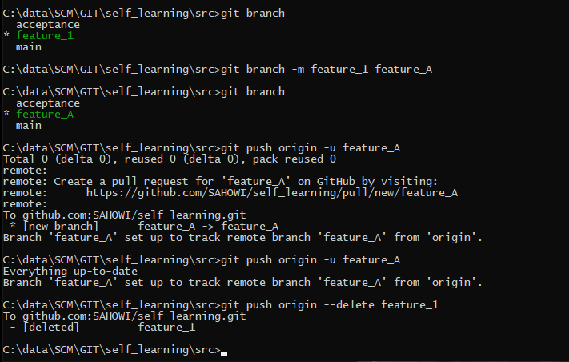

# GIT Playground
This Repor is used for myself to play around with the various features.
In the same time I hopefully find the time to document my changes,
so this can also be used as reference/info material for others.
Have fun!


## Branches

### Create a Branch and make it active
I created a new branch "acceptance" and switch into it by 

```bash
git branch acceptance
git switch acceptance
code README.md
git push --set-upstream origin acceptance
```

and updated the README.md inside of this branch.

### Merge Branches
To merge the changes back to "main" simply do the following:
```bash
git switch main
git update # to ensure main is definitely up-to-date
git merge acceptance
Updating 44c3cfd..28976e6
Fast-forward
 README.md | 12 ++++++++++++
 1 file changed, 12 insertions(+)
git push
```

### Rename a Branch local and remote




